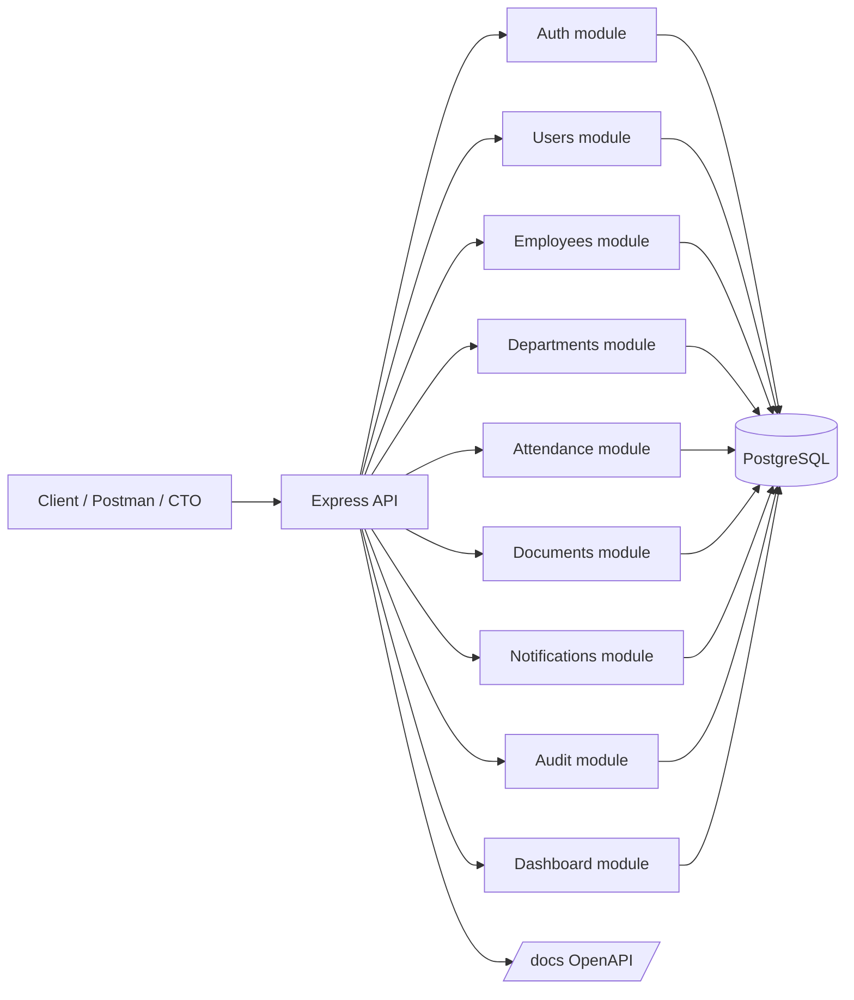

# Arkena Core

Production-oriented REST API for enterprise workforce management, built with Node.js, TypeScript, Express, PostgreSQL and Prisma.

## What It Does

Arkena Core is a reusable enterprise backend reference that covers:

- authentication with access and refresh tokens
- RBAC with permissions mapped to roles
- users, employees and departments
- attendance tracking and summaries
- secure document storage and download
- internal notifications
- audit logging
- dashboard statistics
- OpenAPI documentation
- production-grade health probes and graceful shutdown

## Stack

- Node.js
- TypeScript
- Express.js
- PostgreSQL
- Prisma
- JWT access token + refresh token
- Zod
- bcrypt
- Multer
- Swagger / OpenAPI
- Docker + Docker Compose
- Vitest + Supertest
- Pino

## Architecture



The code is organized by domain:

```text
src/
  modules/
    auth/
    users/
    employees/
    departments/
    attendance/
    documents/
    notifications/
    audit/
    dashboard/
  common/
    middleware/
    errors/
    validation/
    security/
    logger/
  config/
  database/
  docs/
  app.ts
  server.ts
```

Each module follows the same split:

- `controller`
- `service`
- `repository`
- `routes`
- validation schema
- types

## Quick Start

1. Copy `.env.example` to `.env`
2. Set secrets and database credentials
3. Run the stack:

```bash
docker compose up
```

The Compose stack runs Prisma migrations and the demo seed automatically, and ships with safe development defaults for local boot. Replace them before any production use.

The API will be available at:

- `http://localhost:3000`
- `http://localhost:3000/docs`
- `http://localhost:3000/health/live`
- `http://localhost:3000/health/ready`

If port `3000` is already in use on your machine, set `API_PORT` in `.env` to another host port, for example `3002`. The container still listens on `3000`.

Progress tracking for the current implementation lives in [PROGRESS.md](C:/Users/Ameno%20MonarQue/Documents/ChatGPT/Arkena%20Core/PROGRESS.md).

## Environment Variables

Key variables:

- `SERVICE_NAME`
- `SERVICE_VERSION`
- `LOG_LEVEL`
- `DATABASE_URL`
- `JWT_ACCESS_SECRET`
- `JWT_REFRESH_SECRET`
- `JWT_RESET_SECRET`
- `ACCESS_TOKEN_TTL`
- `REFRESH_TOKEN_TTL`
- `RESET_TOKEN_TTL`
- `CORS_ORIGINS`
- `TRUST_PROXY`
- `RATE_LIMIT_WINDOW_MS`
- `RATE_LIMIT_MAX_REQUESTS`
- `BODY_SIZE_LIMIT`
- `ENABLE_OPENAPI_DOCS`
- `GRACEFUL_SHUTDOWN_TIMEOUT_MS`
- `READINESS_DB_TIMEOUT_MS`
- `UPLOAD_DIR`
- `MAX_FILE_SIZE_BYTES`

## Migrations

The initial migration is committed in `prisma/migrations/00000000000000_init`.

Useful commands:

```bash
npx prisma generate
npx prisma migrate deploy
npm run prisma:seed
```

## Tests

Run the test suite with:

```bash
npm test
```

The project is set up for unit and integration tests using Vitest and Supertest.

For the release smoke flow against a live API, run:

```bash
RUN_RELEASE_E2E=true E2E_BASE_URL=http://127.0.0.1:3000 npm run test:e2e
```

## API Docs

OpenAPI is served at:

```text
http://localhost:3000/docs
```

Operational probes:

```text
http://localhost:3000/health/live
http://localhost:3000/health/ready
```

## Demo Accounts

The seed creates these sample users:

- `admin@arkena.local` / `ChangeMe123!`
- `hr@arkena.local` / `HrPass123!`
- `manager@arkena.local` / `Manager123!`
- `employee@arkena.local` / `Employee123!`

## Example Requests

### Login

```bash
POST /auth/login
{
  "email": "admin@arkena.local",
  "password": "ChangeMe123!"
}
```

### List Employees

```bash
GET /employees?page=1&limit=20&departmentId=...&status=ACTIVE&search=amina
```

### Attendance Summary

```bash
GET /attendance/summary?from=2026-08-01T00:00:00.000Z&to=2026-08-31T23:59:59.999Z
```

## License

MIT
